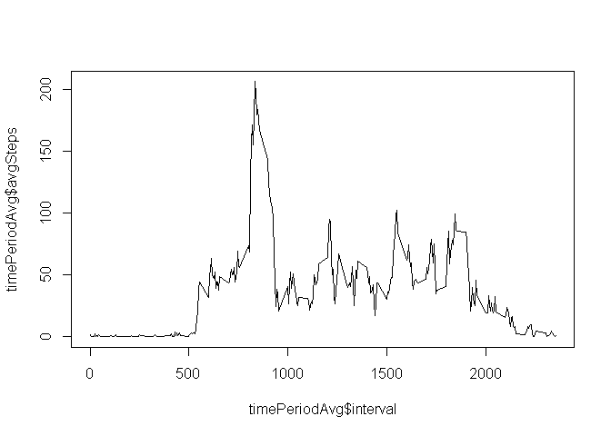

# Reproducible Research: Peer Assessment 1

##Loading and preprocessing the data
Unzip  activity.zip data file and read

```r
unzip("activity.zip")
act<-read.csv("activity.csv")
```

## What is mean total number of steps taken per day?

Calculate the total number of steps taken per day
Let's eliminate rows with na, and get the total number of steps per day.
Then we remove days with no steps

```r
actnoblanks<-act[complete.cases(act),]
dayStepSums<- aggregate(actnoblanks$steps, by=list(actnoblanks$date),sum)
names(dayStepSums)<-c("datestep","stepcount")
```
Histogram of the total number of steps each day

```r
hist(dayStepSums$stepcount, xlab = "Steps per day", main="", col="blue", lwd=2)
```

 

Mean and median of the total number of steps taken per day  

```r
mean(dayStepSums$stepcount)  
```

```
## [1] 10766.19
```

```r
median(dayStepSums$stepcount)
```

```
## [1] 10765
```

```r
#summary(dayStepSums$stepcount)
```

## What is the average daily activity pattern?

```r
timePeriodAvg<-aggregate(actnoblanks$steps, by=list(actnoblanks$interval),mean)
names(timePeriodAvg)<-c("interval","avgSteps")
plot(timePeriodAvg$interval, timePeriodAvg$avgSteps, type="l")
```

 
  
Which 5 minute interval, on average contains the maximum number of steps?

```r
timePeriodAvg[timePeriodAvg$avgSteps==max(timePeriodAvg$avgSteps),]$interval
```

```
## [1] 835
```

## Imputing missing values

What is the total no of missing values in the data?

```r
badrows<-act[is.na(act$steps),]
nrow(badrows)
```

```
## [1] 2304
```
There are 2304 rows with missing steps

Let us fill in data for missing steps using the following rule  
**For rows with NA steps use the mean steps for that interval**

We shall lookup the average number of steps for an interval from our previously computed timePeriodAvg  


```r
act2<-act

replaceMissingSteps<- function(st,intrv) {
  if(is.na(st)){
    timePeriodAvg[match(intrv, timePeriodAvg$interval),]$avgSteps
  } else{
    st
  }
}

goodSteps<-mapply(replaceMissingSteps, st=act2$steps, intrv=act2$interval)
act2$steps<-as.vector(goodSteps)
nrow(act2[is.na(act2$steps),])
```

```
## [1] 0
```
After performing the above operation there are 0 rows with missing steps.  
So we can proceed  

Make a histogram of the total number of steps taken each day and Calculate and report the mean and median total number of steps taken per day. Do these values differ from the estimates from the first part of the assignment? What is the impact of imputing missing data on the estimates of the total daily number of steps?


```r
dayStepSums2<- aggregate(act2$steps, by=list(act2$date),sum)
names(dayStepSums2)<-c("datestep","stepcount")
```

```r
hist(dayStepSums2$stepcount, xlab = "Steps per day", main="", col="blue", lwd=2)
```

 
Let us examine the means and median of dayStepSum

```r
mean(dayStepSums2$stepcount)  
```

```
## [1] 10766.19
```

```r
median(dayStepSums2$stepcount)
```

```
## [1] 10766.19
```
We find that the mean has not changed at all while the median is slightly different.


## Are there differences in activity patterns between weekdays and weekends?

Let us copy the data to act3 and add a column called isweekend to the data

```r
act3<-act2
whichday<- function(d) {if(weekdays(as.Date(d)) %in% c("Saturday","Sunday")) "weekend" else "weekday"}
act3$dayofweek <- sapply(act3$date, whichday)
#weekdayDat<-aggregate(steps~interval, data=act3,subset=act3$dayofweek=="weekday", FUN=mean)
library(ggplot2)
```

```
## Warning: package 'ggplot2' was built under R version 3.1.3
```

```r
qplot(interval,steps, data=act3,facets=dayofweek~., geom=c("line"), layout=c(1,1), stat="summary", fun.y="mean")
```

 

It appears that on weekdays most of the activity is done in the morning while on weekends it is more spread out during the day
